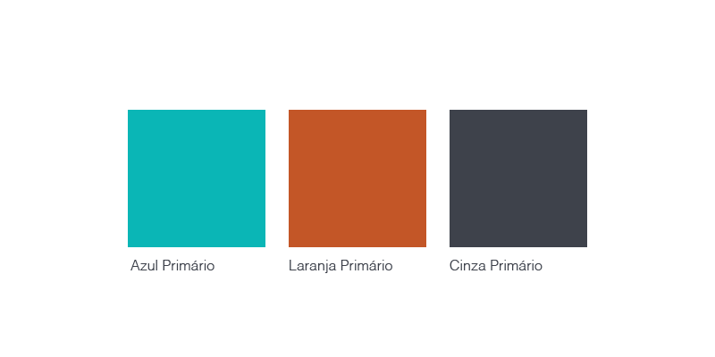
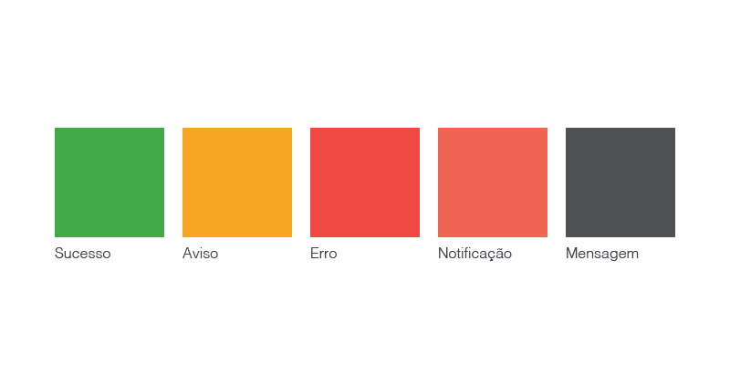

# CORES DA INTERFACE
- Psicologia das cores

 

# CORES - UI Primárias
- **Paleta Primária**: mais importantes de todo o sistema. É composta pelas principais cores da marca, tons de cinza e geralmente, o azul flat. Cor fria, cor quente e uma cor neutra.

- **Paleta Secundária**: as variações das cores primárias e tons de cinza, escolher as cores que já tem por padrão um significado próprio. EX: vermelho = erro, amarelo = avisos, verde = sucesso.

 

# CORES - GRADIENTE

- **Gradiente ou degradê**: redesign de logos (ex: logo do insta) e vem sendo introduzida nas UI. Proporciona dinamismo e movimento,  interfaces precisam ser amigáveis e intuitivas, isso ajuda a ter essas sensações.
