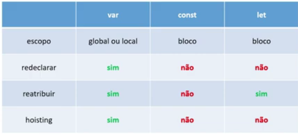
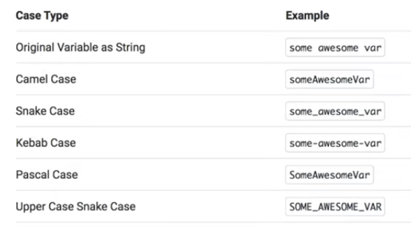
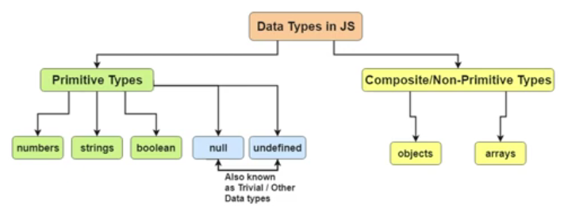
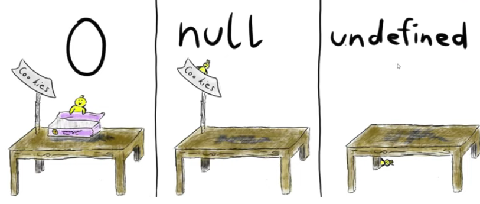

## VAR, LET e CONST

## Formas de escrever variáveis

## Estruturas de dados

## Empty, null e undefined

# Verificar o tipo de uma variável:
### typeof <.variavel que deseja saber o tipo.>

# Arrays/Vetores
- lista iterável de elementos

### Exemplos de declaração de array: 
### let nomeArray = []
### let array = new Array[]
### Adicionar itens no final do array: nomeArray.push(3)
### tirar **último** elemento de um array: nomeArray.pop()
### tirar **primeiro** elemento do array: nomeArray.shift()
### tirar **primeiro** elemento do array: nomeArray.unshift()